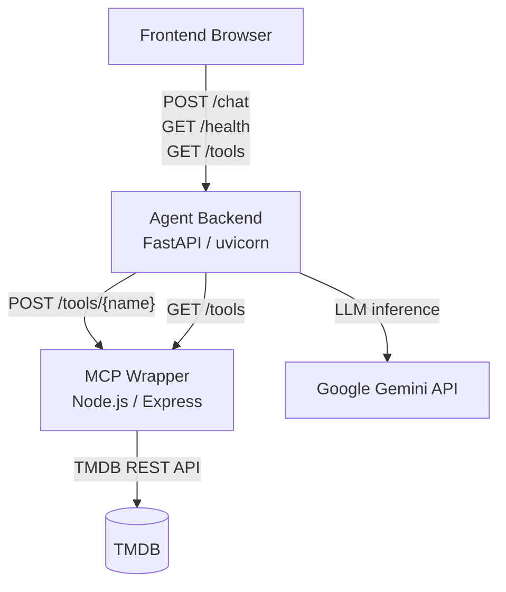
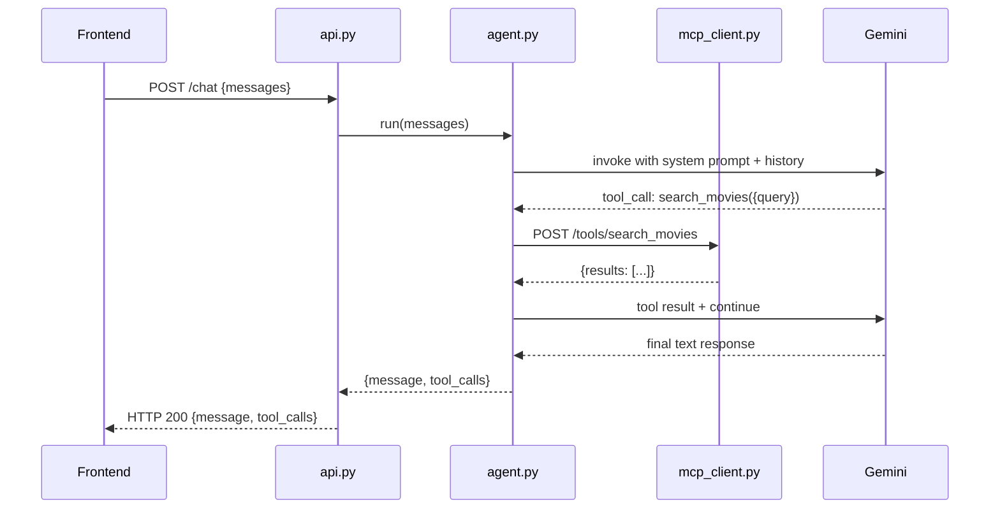
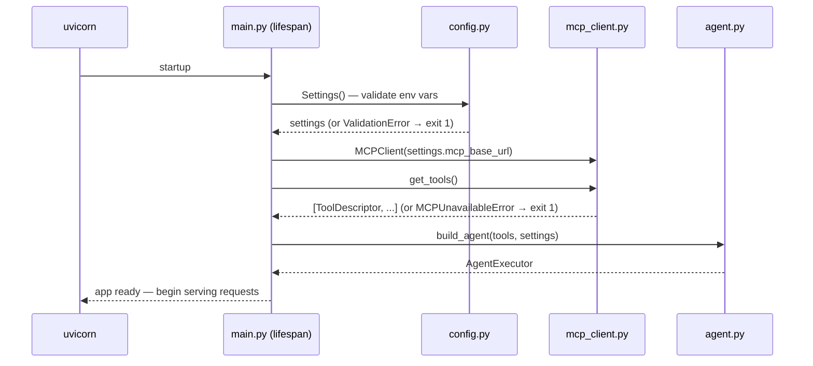
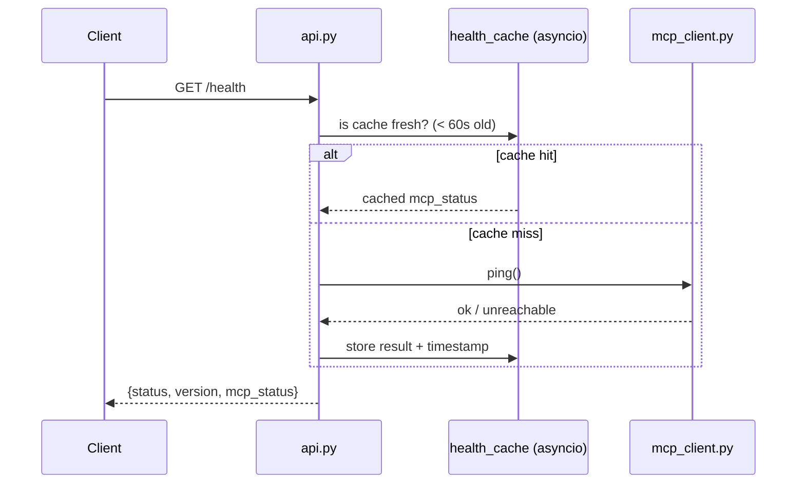
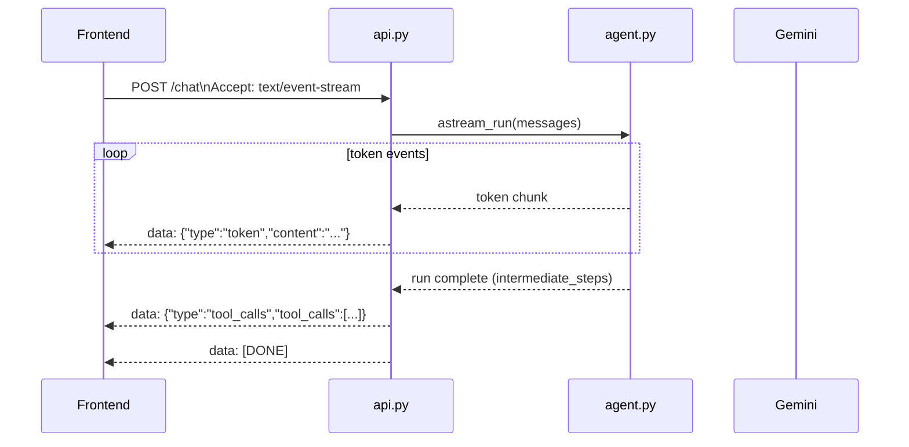
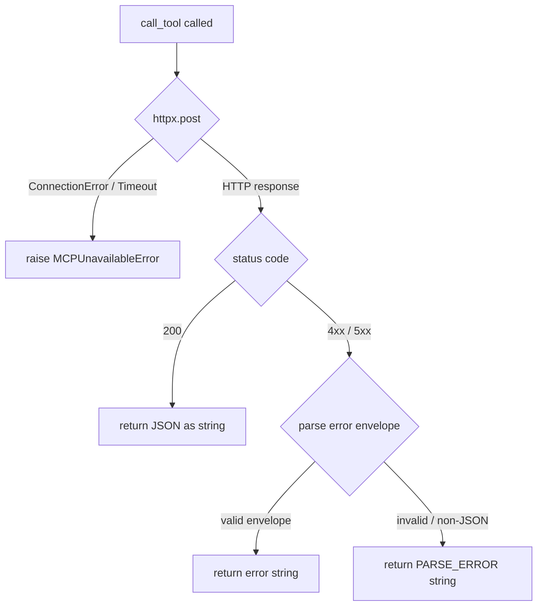

# Design Document — Agent Backend

## Overview

The Agent Backend is a stateless FastAPI service that bridges a browser-based frontend and the existing MCP wrapper microservice. It discovers movie tools from the MCP wrapper at startup, registers them dynamically as LangChain `StructuredTool` instances bound to a Gemini language model, and exposes a chat API that accepts full conversation history and returns the assistant's reply together with an ordered trace of every tool call made during the run.

The service owns the Gemini API key and the agent orchestration logic. It never holds the TMDB API key — all movie data flows exclusively through the MCP wrapper's HTTP API.

### Key Design Goals

- **Fail fast**: missing config or an unreachable MCP wrapper at startup terminates the process immediately with a clear message.
- **Agent resilience**: MCP errors during a run are translated into agent-readable strings so the LLM can reason about failures rather than crashing.
- **Stateless**: no session state is stored server-side; the frontend sends the full conversation history on every request.
- **Observable**: every request produces a single structured JSON log record with a unique `request_id`.
- **Streaming-optional**: the same `/chat` endpoint serves both blocking JSON and SSE streaming responses based on the `Accept` header.

---

## Architecture

### Component Diagram



### Request Flow (non-streaming)



### Startup Sequence



### GET /health Sequence



### POST /chat SSE Streaming Sequence



---

## Module Responsibilities

### `app/main.py` — App Factory and Lifespan

Constructs the FastAPI application instance, registers middleware (CORS, request-ID injection, structured logging), and manages the application lifespan via an `asyncio` context manager.

**Lifespan responsibilities:**
- Instantiate `Settings` (fails fast on missing env vars).
- Create the `MCPClient` and call `get_tools()` (fails fast if MCP is unreachable).
- Call `build_agent()` to construct the `AgentExecutor`.
- Store the executor and MCP client on `app.state` for route handlers.
- On shutdown: close the `httpx.AsyncClient` inside `MCPClient`.

```python
@asynccontextmanager
async def lifespan(app: FastAPI):
    settings = Settings()
    mcp_client = MCPClient(settings.mcp_base_url)
    tools = await mcp_client.get_tools()          # raises MCPUnavailableError → exit 1
    executor = build_agent(tools, settings)
    app.state.executor = executor
    app.state.mcp_client = mcp_client
    app.state.settings = settings
    yield
    await mcp_client.close()
```

### `app/api.py` — Route Handlers

Defines the three HTTP endpoints. Each handler reads `app.state` for the executor and MCP client, delegates to `agent.py` or `mcp_client.py`, and maps typed exceptions to HTTP error responses.

| Route | Handler | Delegates to |
|---|---|---|
| `POST /chat` | `chat()` | `agent.run()` or `agent.astream_run()` |
| `GET /health` | `health()` | `mcp_client.ping()` (cached) |
| `GET /tools` | `tools()` | `app.state.executor.tools` |

The `chat()` handler inspects the `Accept` header:
- `Accept: text/event-stream` → returns `StreamingResponse` backed by `agent.astream_run()`.
- Anything else → awaits `agent.run()` and returns a `JSONResponse`.

Error mapping:

| Exception | HTTP Status | Error Code |
|---|---|---|
| `RequestValidationError` | 422 | `VALIDATION_ERROR` |
| `MCPUnavailableError` | 503 | `MCP_UNAVAILABLE` |
| `LLMError` | 502 | `LLM_ERROR` |

### `app/agent.py` — Agent Construction and Execution

Owns the LangChain `AgentExecutor` lifecycle.

**`build_agent(tool_descriptors, settings) → AgentExecutor`**

Converts each `ToolDescriptor` into a `StructuredTool` (see Dynamic Tool Loading section), constructs the Gemini chat model via `ChatGoogleGenerativeAI`, assembles the prompt from `SYSTEM_PROMPT`, and returns a configured `AgentExecutor`.

**`run(executor, messages) → ChatResponse`**

Invokes the executor synchronously (via `asyncio.run` or `await executor.ainvoke`), collects `intermediate_steps`, and builds the `ChatResponse` including the `tool_calls` trace.

**`astream_run(executor, messages) → AsyncGenerator[str, None]`**

Uses `executor.astream_events()` to yield SSE-formatted strings. Emits `token` events for each LLM chunk and a final `tool_calls` event after the run completes.

### `app/mcp_client.py` — MCP HTTP Client

Wraps all communication with the MCP wrapper using `httpx.AsyncClient`.

**Public interface:**

```python
class MCPClient:
    async def get_tools(self) -> list[ToolDescriptor]
    async def call_tool(self, name: str, args: dict) -> str
    async def ping(self) -> bool
    async def close(self) -> None
```

`call_tool` is the function registered as the `func` of each `StructuredTool`. It:
1. POSTs to `MCP_BASE_URL/tools/{name}` with `args` as the JSON body.
2. On success: returns the JSON response body as a formatted string.
3. On 4xx/5xx: extracts the `error.code` and `error.message` from the error envelope and returns a structured error string (never raises).
4. On connection failure / timeout: raises `MCPUnavailableError`.

### `app/schemas.py` — Pydantic v2 Models

All request and response shapes. See Data Models section.

### `app/config.py` — Settings

`pydantic-settings` `BaseSettings` subclass. Loads from environment variables and `.env` file. Uses `SecretStr` for `GEMINI_API_KEY` to prevent accidental logging.

```python
class Settings(BaseSettings):
    gemini_api_key: SecretStr
    mcp_base_url: AnyHttpUrl
    frontend_origin: str = "http://localhost:3000"
    version: str = "0.1.0"
    log_level: str = "INFO"

    model_config = SettingsConfigDict(env_file=".env", env_file_encoding="utf-8")
```

### `app/logging.py` — Structlog Configuration

Configures `structlog` with a JSON renderer. Adds a middleware-injected `request_id` to every log record within a request context. Ensures `SecretStr` values are never serialised.

### `app/agent/prompt.py` — System Prompt

Exports a single `SYSTEM_PROMPT: str` constant. The prompt defines the agent as a movie recommendation assistant, specifies tool-use policy, instructs the agent to chain tools when needed, and prohibits fabricating movie data.

---

## Data Models

### Request Models

```python
class MessageRole(str, Enum):
    user = "user"
    assistant = "assistant"

class Message(BaseModel):
    role: MessageRole
    content: str

class ChatRequest(BaseModel):
    messages: list[Message]
    model_config = ConfigDict(extra="forbid")
```

### Response Models

```python
class ToolCall(BaseModel):
    tool: str
    input: dict[str, Any]
    output_summary: str

class Movie(BaseModel):
    """A single movie extracted from tool call results."""
    id: int
    title: str
    year: int | None = None
    poster_url: str | None = None
    rating: float | None = None

class AssistantMessage(BaseModel):
    role: Literal["assistant"] = "assistant"
    content: str
    movies: list[Movie] = []

class ChatResponse(BaseModel):
    message: AssistantMessage
    tool_calls: list[ToolCall]

class ErrorDetail(BaseModel):
    code: str
    message: str

class ErrorResponse(BaseModel):
    error: ErrorDetail
```

### Health / Tools Models

```python
class HealthResponse(BaseModel):
    status: Literal["ok"] = "ok"
    version: str
    mcp_status: Literal["ok", "unreachable"]

class ToolInfo(BaseModel):
    name: str
    description: str

class ToolsResponse(BaseModel):
    tools: list[ToolInfo]
```

### Internal Models

```python
class ToolDescriptor(BaseModel):
    """Parsed from MCP GET /tools response."""
    name: str
    description: str
    input_schema: dict[str, Any]   # raw JSON Schema object
```

### SSE Event Protocol

Each SSE event is a JSON-encoded string on the `data:` field, followed by `\n\n`.

| Event type | Payload shape | When emitted |
|---|---|---|
| `token` | `{"type": "token", "content": "string"}` | Each LLM output token chunk |
| `movies` | `{"type": "movies", "movies": [Movie]}` | Once after final token, before `tool_calls` (only if movies are present) |
| `tool_calls` | `{"type": "tool_calls", "tool_calls": [ToolCall]}` | Once, after all tokens (and after `movies` if present) |
| `error` | `{"type": "error", "code": "string", "message": "string"}` | On agent error |
| `done` | `{"type": "done"}` | Final event, signals stream end |

Example stream:
```
data: {"type":"token","content":"Here are"}

data: {"type":"token","content":" some great action movies:"}

data: {"type":"movies","movies":[{"id":76341,"title":"Mad Max: Fury Road","year":2015,"poster_url":"https://image.tmdb.org/t/p/w500/...","rating":7.6},{"id":245891,"title":"John Wick","year":2014,"poster_url":"https://image.tmdb.org/t/p/w500/...","rating":7.4}]}

data: {"type":"tool_calls","tool_calls":[{"tool":"search_movies","input":{"query":"action"},"output_summary":"Found 20 action movies including Mad Max and John Wick."}]}

data: {"type":"done"}
```

The `movies` event is only emitted when the movie extractor finds at least one movie whose title appears in the LLM's prose. If no movies are extracted, the event is omitted entirely.

---

## Dynamic Tool Loading Algorithm

At startup, `build_agent()` converts each `ToolDescriptor` from the MCP wrapper into a LangChain `StructuredTool`. The key challenge is that LangChain requires a Pydantic model as the `args_schema` — this model must be constructed dynamically from the JSON Schema returned by the MCP wrapper.

### Algorithm (pseudocode)

```
function build_args_schema(tool_name: str, input_schema: dict) -> type[BaseModel]:
    fields = {}
    required_fields = set(input_schema.get("required", []))
    properties = input_schema.get("properties", {})

    for field_name, field_schema in properties.items():
        python_type = json_schema_type_to_python(field_schema)
        if field_name in required_fields:
            fields[field_name] = (python_type, FieldInfo(description=field_schema.get("description", "")))
        else:
            fields[field_name] = (Optional[python_type], FieldInfo(default=None, description=field_schema.get("description", "")))

    return create_model(f"{tool_name}_args", **fields)

function json_schema_type_to_python(field_schema: dict) -> type:
    type_map = {
        "string":  str,
        "integer": int,
        "number":  float,
        "boolean": bool,
        "array":   list,
        "object":  dict,
    }
    return type_map.get(field_schema.get("type", "string"), str)

function build_tool(descriptor: ToolDescriptor, mcp_client: MCPClient) -> StructuredTool:
    args_schema = build_args_schema(descriptor.name, descriptor.input_schema)

    async def tool_func(**kwargs) -> str:
        return await mcp_client.call_tool(descriptor.name, kwargs)

    return StructuredTool(
        name=descriptor.name,
        description=descriptor.description,
        args_schema=args_schema,
        coroutine=tool_func,
    )
```

### Type Mapping Table

| JSON Schema type | Python type |
|---|---|
| `"string"` | `str` |
| `"integer"` | `int` |
| `"number"` | `float` |
| `"boolean"` | `bool` |
| `"array"` | `list` |
| `"object"` | `dict` |
| (missing / unknown) | `str` (safe fallback) |

Optional fields (not in `required`) are wrapped in `Optional[T]` with `default=None`.

---

## Tool Call Tracing Mechanism

LangChain's `AgentExecutor` stores all intermediate steps in the result dict under the key `"intermediate_steps"`. Each step is a tuple of `(AgentAction, tool_output_str)`.

After `executor.ainvoke()` returns, `agent.py` iterates `result["intermediate_steps"]` to build the `tool_calls` list:

```python
tool_calls = []
for action, raw_output in result.get("intermediate_steps", []):
    summary = summarise_output(raw_output)   # see below
    tool_calls.append(ToolCall(
        tool=action.tool,
        input=action.tool_input,
        output_summary=summary,
    ))
```

### `output_summary` Generation

The `output_summary` is generated by a lightweight template-based approach rather than a second LLM call (to avoid latency and cost):

```python
def summarise_output(raw_output: str) -> str:
    """
    Produce a 1-2 sentence summary of a tool result string.
    Falls back to a truncated version of the raw output if parsing fails.
    """
    try:
        data = json.loads(raw_output)
        if "results" in data:
            count = len(data["results"])
            titles = [r.get("title", "") for r in data["results"][:3]]
            return f"Found {count} result(s). Top titles: {', '.join(titles)}."
        if "error" in data:
            return f"Tool returned error {data['error']['code']}: {data['error']['message']}."
        # Single-object responses (get_movie_details, get_movie_id, get_genre_id)
        return _summarise_object(data)
    except (json.JSONDecodeError, KeyError):
        return raw_output[:200]
```

This keeps the summary deterministic and avoids a second round-trip to the LLM.

---

## Movie Extractor Module

The `app/agent/movie_extractor.py` module is a deterministic post-processor that inspects intermediate tool call results from the agent run, filters to movies whose titles appear in the LLM's prose output, and returns them as structured `Movie` objects ordered by first mention position.

### Public Interface

```python
MOVIE_TOOLS: frozenset[str] = frozenset({
    "search_movies",
    "discover_movies",
    "get_recommendations",
    "get_trending",
})

def extract_movies(
    intermediate_steps: list[tuple[Any, str]],
    llm_content: str,
    max_count: int = 5,
) -> list[Movie]:
    """
    Extract structured movie data from agent intermediate steps,
    filtered to only movies whose titles appear in the LLM's prose.

    Never raises — returns [] on any error.
    """
```

### Internal Helpers

```python
def _parse_movies_from_output(raw_output: str) -> list[Movie]:
    """Parse a single tool output string into a list of Movie objects.
    Returns [] if the output is malformed, missing 'results', or contains an error envelope."""

def _find_title_position(title: str, llm_content_lower: str) -> int:
    """Return the index of the first case-insensitive occurrence of title.
    Returns -1 if not found."""
```

### Algorithm

The extraction follows a five-phase pipeline:

1. **Collect candidates** — Iterate `intermediate_steps` in invocation order. For each step whose `action.tool` is in `MOVIE_TOOLS`, parse the raw JSON output, skip error envelopes and malformed entries, and map each entry in the `results` array to a `Movie` object.
2. **Filter by title presence** — For each candidate movie, perform a case-insensitive substring search (`str.find()`) for the movie's title within the LLM content. Only movies whose titles appear in the prose are kept, along with their first-mention position.
3. **Sort by first mention** — Sort the filtered movies by their first-mention position in the LLM content (earliest first), so card order matches reading order.
4. **Deduplicate by ID** — Walk the sorted list and keep only the first occurrence of each movie `id` (first-seen wins).
5. **Cap at max_count** — Truncate the result to at most `max_count` entries (default 5).

The entire function body is wrapped in a `try/except` to guarantee it never raises exceptions to the caller — on any error it returns `[]`.

### Wiring into `agent_runner.py`

**JSON mode (`run()`):** After building `tool_calls` from `intermediate_steps`, call `extract_movies(intermediate_steps, output)` and attach the result to `AssistantMessage(content=..., movies=movies)`.

**SSE mode (`astream_run()`):** After the streaming loop completes and the full LLM content has been accumulated, call `extract_movies(intermediate_steps, full_output)`. If the result is non-empty, emit a `movies` SSE event (`{"type": "movies", "movies": [...]}`) after the final token event and before the `tool_calls` event. If no movies are extracted, the event is omitted.

### Design Decisions

| Decision | Rationale |
|---|---|
| Title filtering uses case-insensitive substring match (`str.find()`) | Simple, predictable, avoids regex complexity and false negatives from word-boundary matching |
| Ordering by first mention position in LLM content | Cards appear in the same order the user reads them in the prose |
| Deduplication by `id` (first-seen wins) | A movie may appear in multiple tool results (e.g., search + recommendations); keep the first by mention order |
| `max_count` defaults to 5 | Keeps the UI manageable; configurable per call for future flexibility |
| `movies` SSE event emitted after tokens, before `tool_calls` | Frontend can render cards as soon as the prose is complete, before the tool trace arrives |
| `extract_movies` accepts `list[tuple[Any, str]]` | Works with both real `AgentAction` and `_FakeAction` objects — only `.tool` attribute is accessed |
| Entire function wrapped in try/except | Guarantees no exceptions propagate; malformed tool outputs are silently skipped |

---

## MCP Error Translation

The `MCPClient.call_tool()` method translates all MCP wrapper error conditions into one of two outcomes:

1. **Structured tool error string** — returned to the `AgentExecutor` as the tool result. The agent can read this and reason about it (e.g., "the movie was not found, let me try a different ID").
2. **`MCPUnavailableError`** — raised when the MCP wrapper cannot be reached at all. This propagates up to `api.py` which maps it to HTTP 503.

### Translation Table

| Condition | MCP HTTP Status | Outcome | Error string format |
|---|---|---|---|
| Tool logic error | 400 | Tool error string | `"Error [VALIDATION_ERROR]: query is missing or empty"` |
| Resource not found | 404 | Tool error string | `"Error [NOT_FOUND]: Movie does not exist on TMDB"` |
| Rate limited | 429 | Tool error string | `"Error [RATE_LIMITED]: TMDB upstream rate limit reached"` |
| MCP server error | 500 | Tool error string | `"Error [INTERNAL_ERROR]: Unexpected server error"` |
| Connection refused | — | `MCPUnavailableError` | (exception, not string) |
| Timeout | — | `MCPUnavailableError` | (exception, not string) |
| Unexpected non-JSON body | — | Tool error string | `"Error [PARSE_ERROR]: Unexpected response from tool server"` |

### Error Translation Flow



### `MCPUnavailableError`

```python
class MCPUnavailableError(Exception):
    """Raised when the MCP wrapper cannot be reached (connection refused, timeout)."""
    def __init__(self, url: str, cause: Exception):
        super().__init__(f"MCP wrapper unreachable at {url}: {cause}")
        self.url = url
        self.cause = cause
```

---

## Health Check Caching

The `/health` endpoint caches the `mcp_status` result for 60 seconds to avoid hammering the MCP wrapper on every health poll.

```python
class HealthCache:
    def __init__(self, ttl_seconds: int = 60):
        self._lock = asyncio.Lock()
        self._cached_status: str | None = None
        self._last_checked: float = 0.0
        self._ttl = ttl_seconds

    async def get_mcp_status(self, mcp_client: MCPClient) -> str:
        now = time.monotonic()
        if self._cached_status is not None and (now - self._last_checked) < self._ttl:
            return self._cached_status
        async with self._lock:
            # Double-check after acquiring lock
            now = time.monotonic()
            if self._cached_status is not None and (now - self._last_checked) < self._ttl:
                return self._cached_status
            try:
                reachable = await mcp_client.ping()
                self._cached_status = "ok" if reachable else "unreachable"
            except MCPUnavailableError:
                self._cached_status = "unreachable"
            self._last_checked = time.monotonic()
            return self._cached_status
```

The double-check pattern inside the lock prevents multiple concurrent requests from all triggering a refresh simultaneously.

---

## Secret Safety

`GEMINI_API_KEY` is stored as `pydantic.SecretStr`. This means:

- `str(settings.gemini_api_key)` → `"**********"` (masked)
- `settings.gemini_api_key.get_secret_value()` → actual key (only called when constructing `ChatGoogleGenerativeAI`)
- `repr(settings)` → masked
- structlog serialises the `Settings` object via its `__repr__`, so the key never appears in logs

The `MCPClient` stores `mcp_base_url` as a plain string (it is not a secret), but it is never included in response bodies.

---

## Error Handling

### Startup Errors

| Condition | Behaviour |
|---|---|
| Missing `GEMINI_API_KEY` | `pydantic_settings.ValidationError` → log + `sys.exit(1)` |
| Missing `MCP_BASE_URL` | `pydantic_settings.ValidationError` → log + `sys.exit(1)` |
| MCP unreachable at startup | `MCPUnavailableError` → log + `sys.exit(1)` |
| MCP returns error at startup | `MCPStartupError` → log + `sys.exit(1)` |

### Runtime Errors

| Condition | HTTP Status | Error Code |
|---|---|---|
| Invalid request body | 422 | `VALIDATION_ERROR` |
| Gemini API error | 502 | `LLM_ERROR` |
| MCP unreachable during run | 503 | `MCP_UNAVAILABLE` |
| Unhandled exception | 500 | `INTERNAL_ERROR` |

MCP tool errors (4xx/5xx from the wrapper) are **not** surfaced as HTTP errors — they are returned to the agent as tool result strings so the LLM can handle them gracefully.

---

## Correctness Properties

*A property is a characteristic or behavior that should hold true across all valid executions of a system — essentially, a formal statement about what the system should do. Properties serve as the bridge between human-readable specifications and machine-verifiable correctness guarantees.*

### Property 1: Tool construction completeness and fidelity

*For any* list of tool descriptors returned by the MCP wrapper (varying names, descriptions, and input schemas), the `build_agent` function SHALL produce exactly one `StructuredTool` per descriptor, and each tool's `name`, `description`, and `args_schema` field names SHALL match the corresponding descriptor fields.

**Validates: Requirements 1.2, 1.3, 1.6**

### Property 2: Tool call trace completeness

*For any* sequence of tool invocations made by the `AgentExecutor` during a single run, the `tool_calls` array in the `ChatResponse` SHALL contain exactly one entry per invocation, in invocation order, with the correct `tool` name and `input` values.

**Validates: Requirements 3.4**

### Property 3: MCP error translation — no unhandled exceptions

*For any* HTTP status code in the 4xx–5xx range returned by the MCP wrapper (with a valid or invalid error envelope), `MCPClient.call_tool()` SHALL return a non-empty string and SHALL NOT raise any exception.

**Validates: Requirements 4.1, 4.2, 4.3**

### Property 4: MCP error strings contain structured information

*For any* error envelope `{ "error": { "code": C, "message": M } }` returned by the MCP wrapper, the tool error string returned by `MCPClient.call_tool()` SHALL contain both `C` and `M`.

**Validates: Requirements 4.1**

### Property 5: Secret values never appear in outputs

*For any* value assigned to `GEMINI_API_KEY`, that exact string SHALL NOT appear in any log record, HTTP response body, or SSE event emitted by the service during any operation.

**Validates: Requirements 2.5, 6.3, 8.4**

### Property 6: GET /tools response completeness

*For any* set of N tools registered at startup, `GET /tools` SHALL return a response containing exactly N tool entries, each with a non-empty `name` and `description` matching the registered tools.

**Validates: Requirements 6.1, 6.2**

### Property 7: Structured log record shape

*For any* handled HTTP request, the structlog output SHALL contain exactly one JSON record with the fields `request_id`, `endpoint`, `latency`, `tool_calls_made`, and `status`, and the `request_id` SHALL be a non-empty string unique across concurrent requests.

**Validates: Requirements 8.1, 8.2, 8.3**

### Property 8: Health cache — at most one MCP call per TTL window

*For any* N concurrent or sequential calls to `GET /health` within a 60-second window (with no cache invalidation), the `MCPClient.ping()` method SHALL be called at most once.

**Validates: Requirements 5.2**

### Property 9: Invalid request bodies produce 422

*For any* request body that violates the `ChatRequest` schema (wrong role value, missing `content`, non-array `messages`, etc.), `POST /chat` SHALL return HTTP 422 with an error envelope containing `code: "VALIDATION_ERROR"`.

**Validates: Requirements 3.7**

### Property 10: SSE streaming tool call trace completeness

*For any* sequence of tool invocations during a streaming agent run, the final `tool_calls` SSE event SHALL contain exactly the same tool call entries (name, input) as would appear in the non-streaming `ChatResponse.tool_calls` for the same run.

**Validates: Requirements 10.2**

---

## Testing Strategy

### Overview

The test suite uses a dual approach: targeted unit tests for specific examples and error conditions, and property-based tests for universal invariants. The property-based testing library is **[Hypothesis](https://hypothesis.readthedocs.io/)** (Python), configured to run a minimum of 100 examples per property.

No tests require a live Gemini API key or a live TMDB connection. All external dependencies are mocked.

### Unit Tests

Located in `tests/unit/`.

#### `test_tool_loading.py`

- Verifies that `build_args_schema()` correctly maps JSON Schema types to Python types.
- Verifies that optional fields (not in `required`) become `Optional[T]` with `default=None`.
- Verifies that `build_tool()` produces a `StructuredTool` with the correct `name`, `description`, and `args_schema`.
- Example: given the `search_movies` descriptor from the MCP contract, assert the resulting tool has `args_schema` fields `query: str` (required) and `year: Optional[int]`.

#### `test_tools_endpoint.py`

- Verifies that `GET /tools` returns HTTP 200.
- Verifies the response shape matches `ToolsResponse`.
- Verifies each entry contains `name` and `description`.
- Verifies no secret values appear in the response.

#### `test_mcp_error_translation.py`

- Verifies that a 400 response with a valid error envelope returns a tool error string (no exception).
- Verifies that a 404 response returns a tool error string.
- Verifies that a 500 response returns a tool error string.
- Verifies that a connection error raises `MCPUnavailableError`.
- Verifies that a non-JSON response body returns a `PARSE_ERROR` tool error string.

### Integration Test

Located in `tests/integration/test_chat.py`.

Uses `httpx.AsyncClient` with the FastAPI `TestClient` (or `AsyncClient` with `ASGITransport`). Mocks:
- `MCPClient.get_tools()` → returns a fixed list of two tool descriptors.
- `MCPClient.call_tool()` → returns a predetermined JSON string.
- `ChatGoogleGenerativeAI` → patched to return a predetermined `AIMessage` with a tool call followed by a final text response.

Assertions:
- Response is HTTP 200.
- `message.role == "assistant"`.
- `message.content` matches the mocked final text.
- `tool_calls` contains exactly the expected invocations in order.
- `tool_calls[0].output_summary` is a non-empty string of at most two sentences.

### Property-Based Tests

Located alongside unit tests, using Hypothesis `@given` decorator.

Each property test is tagged with a comment referencing the design property:
```python
# Feature: agent-backend, Property 1: Tool construction completeness and fidelity
@given(st.lists(tool_descriptor_strategy(), min_size=1, max_size=20))
@settings(max_examples=100)
def test_tool_construction_completeness(descriptors):
    ...
```

**Property 1 test** (`test_tool_loading.py`): Generates random `ToolDescriptor` lists with varying names, descriptions, and JSON Schema shapes. Asserts output tool count equals input count and each tool's name/description matches.

**Property 2 test** (`test_chat.py`): Generates random sequences of tool call actions. Mocks the executor to return those steps as `intermediate_steps`. Asserts `tool_calls` in the response matches exactly.

**Property 3 & 4 tests** (`test_mcp_error_translation.py`): Generates random 4xx/5xx status codes and random error envelopes. Asserts no exception is raised and the returned string contains the error code and message.

**Property 5 test** (`test_secret_safety.py`): Generates random API key strings. Runs a full request cycle with the key configured. Captures all log output and response bodies. Asserts the key string never appears.

**Property 6 test** (`test_tools_endpoint.py`): Generates random tool lists of size 1–20. Registers them at startup. Asserts `GET /tools` returns exactly that many entries with matching names and descriptions.

**Property 7 test** (`test_logging.py`): Generates random request inputs. Captures structlog output. Asserts each request produces exactly one log record with all required fields and a unique `request_id`.

**Property 8 test** (`test_health.py`): Simulates N calls to `GET /health` within a mocked time window. Asserts `MCPClient.ping()` is called at most once.

**Property 9 test** (`test_chat.py`): Generates invalid `ChatRequest` bodies using Hypothesis strategies. Asserts HTTP 422 with `VALIDATION_ERROR` code.

**Property 10 test** (`test_streaming.py`): Generates random tool call sequences. Runs both streaming and non-streaming modes with the same mock. Asserts the `tool_calls` content is identical in both.

### What Is Not Tested

Per Requirement 12.5, the test suite does not:
- Test LLM output quality or prompt effectiveness.
- Test CORS middleware behaviour.
- Aim for line coverage targets.
- Test the Dockerfile build process.
- Test live Gemini or TMDB connectivity.
