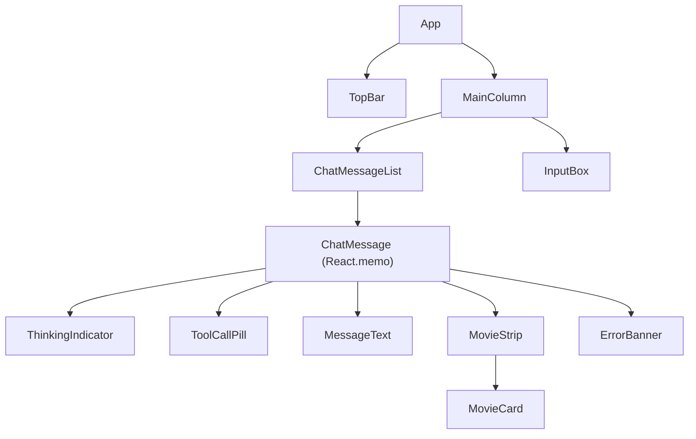
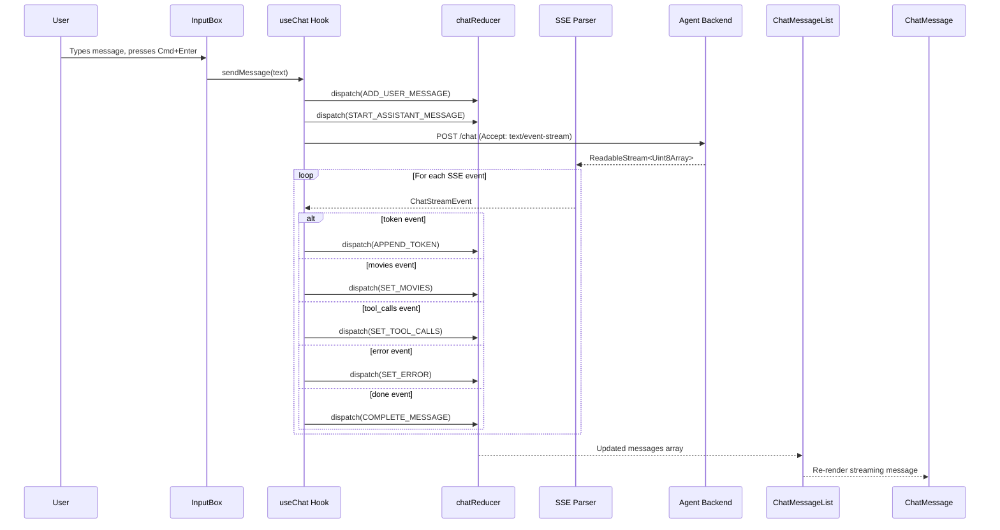
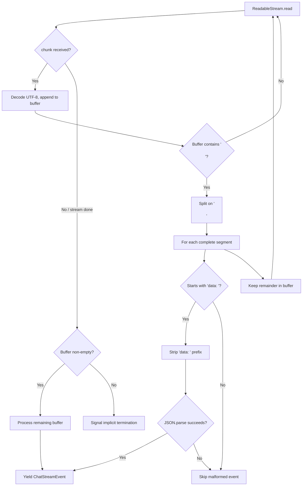
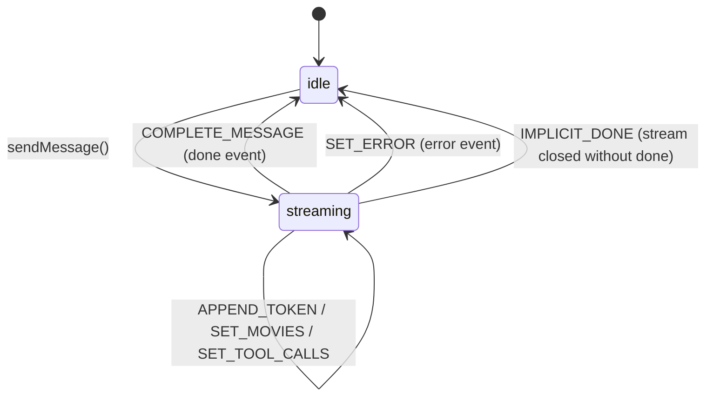
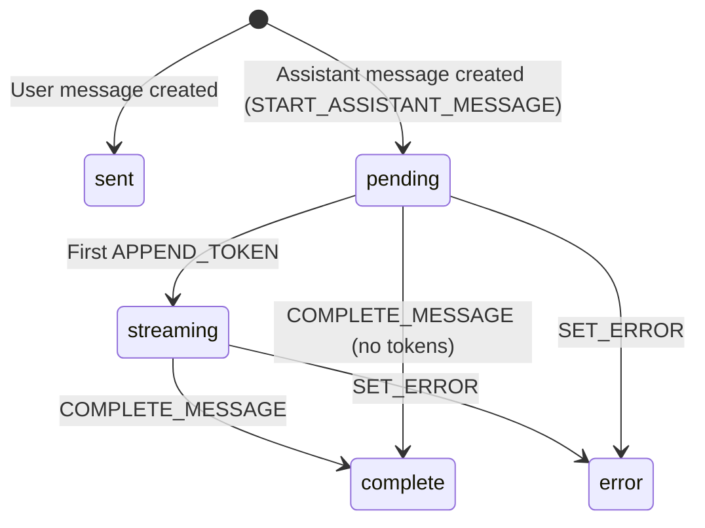

# Design Document — Chat Frontend (Reelify)

## Overview

Reelify is a single-page React 18 + TypeScript chat application that consumes the Agent Backend's `/chat` API over Server-Sent Events. It visualizes the agent's reasoning through inline tool-call pills and renders prose-driven movie cards beneath assistant messages. The application uses Vite for bundling, Tailwind CSS for a dark-only theme, `useReducer` for state management, and native `fetch` + `ReadableStream` for SSE transport — no third-party SSE or state management libraries.

### Key Design Goals

- **Streaming-first**: Messages render progressively as SSE tokens arrive, giving the user real-time feedback.
- **Pure-function SSE parsing**: The SSE parser is a standalone async generator with zero React or DOM dependencies, making it fully unit-testable.
- **Minimal re-renders**: `React.memo` on `ChatMessage` ensures only the actively streaming message re-renders per token.
- **Resilient**: Malformed SSE events are skipped, HTTP errors are caught before the stream starts, and partial content is always preserved.
- **Accessible**: Semantic HTML, `aria-live` regions, keyboard-navigable tool pills, and visible focus indicators.

### Key Design Decisions

| Decision | Rationale |
|---|---|
| `useReducer` over Redux/Zustand | Single-page app with one conversation — global state library is unnecessary overhead |
| Native `fetch` + `ReadableStream` over EventSource/SSE libraries | `EventSource` doesn't support POST requests; native streams give full control over buffering and abort |
| Async generator for SSE parsing | Clean separation of concerns — yields `ChatStreamEvent` objects, composable with `for await` |
| `React.memo` with custom comparator on `ChatMessage` | Prevents O(n) re-renders on every token event — only the streaming message updates |
| Tailwind dark theme only | Matches the "demo UI" scope — no theme toggle complexity |
| Vitest + Testing Library | Aligns with Vite ecosystem; fast, no Webpack config needed |
| No router | Single page, single conversation — routing adds no value |

---

## Architecture

### Component Tree



### Data Flow — Frontend ↔ Agent Backend over SSE



### Health Polling Flow [Removed during implementation]

~~The useHealth hook and HealthIndicator component were removed. Health polling is no longer part of the frontend.~~

### SSE Parser Flow — Chunk Buffering and Event Dispatch



---

## Components and Interfaces

### 1. `src/lib/types.ts` — Type Definitions

All types mirror the Agent Backend contract from `agent_backend/app/schemas.py` and `agent_backend/docs/contracts.md`.

```typescript
// --- Backend contract types ---

export interface Movie {
  id: number;
  title: string;
  year: number | null;
  poster_url: string | null;
  rating: number | null;
}

export interface ToolCall {
  tool: string;
  input: Record<string, unknown>;
  output_summary: string;
}

export interface ToolInfo {
  name: string;
  description: string;
}

export interface HealthStatus {
  status: "ok";
  version: string;
  mcp_status: "ok" | "unreachable";
}

export interface ErrorDetail {
  code: string;
  message: string;
}

export interface ErrorEnvelope {
  error: ErrorDetail;
}

// --- SSE event discriminated union ---

export type ChatStreamEvent =
  | { type: "token"; content: string }
  | { type: "movies"; movies: Movie[] }
  | { type: "tool_calls"; tool_calls: ToolCall[] }
  | { type: "error"; code: string; message: string }
  | { type: "done" };

// --- Frontend message model ---

export type MessageStatus = "sent" | "pending" | "streaming" | "complete" | "error";

export interface Message {
  id: string;
  role: "user" | "assistant";
  content: string;
  status: MessageStatus;
  tool_calls: ToolCall[];
  movies: Movie[];
  error?: ErrorDetail;
}
```

### 2. `src/lib/api.ts` — Typed Fetch Wrappers

```typescript
const BASE_URL = import.meta.env.VITE_AGENT_BASE_URL ?? "http://localhost:8000";

/**
 * POST /chat — returns a ReadableStream for SSE consumption.
 * Throws on non-200 HTTP status (pre-stream error).
 */
export async function postChatStream(
  messages: { role: string; content: string }[],
  signal?: AbortSignal
): Promise<ReadableStream<Uint8Array>> {
  const res = await fetch(`${BASE_URL}/chat`, {
    method: "POST",
    headers: {
      "Content-Type": "application/json",
      Accept: "text/event-stream",
    },
    body: JSON.stringify({ messages }),
    signal,
  });

  if (!res.ok) {
    const envelope: ErrorEnvelope = await res.json();
    throw new ApiError(res.status, envelope.error.code, envelope.error.message);
  }

  if (!res.body) {
    throw new ApiError(0, "NO_BODY", "Response body is null");
  }

  return res.body;
}

/**
 * GET /tools — returns the list of registered tools.
 */
export async function fetchTools(): Promise<ToolInfo[]> {
  const res = await fetch(`${BASE_URL}/tools`);
  if (!res.ok) throw new ApiError(res.status, "TOOLS_ERROR", "Failed to fetch tools");
  const data = await res.json();
  return data.tools;
}

/**
 * GET /health — returns backend health status.
 */
export async function fetchHealth(): Promise<HealthStatus> {
  const res = await fetch(`${BASE_URL}/health`);
  if (!res.ok) throw new ApiError(res.status, "HEALTH_ERROR", "Health check failed");
  return res.json();
}

/**
 * Typed API error with code for error banner mapping.
 */
export class ApiError extends Error {
  constructor(
    public status: number,
    public code: string,
    public detail: string
  ) {
    super(`${code}: ${detail}`);
    this.name = "ApiError";
  }
}
```

### 3. `src/lib/sse.ts` — SSE Parser (Pure Function)

The SSE parser is an async generator that consumes a `ReadableStream<Uint8Array>`, buffers UTF-8 text, splits on `\n\n` boundaries, and yields parsed `ChatStreamEvent` objects. It has zero dependencies on React or DOM APIs.

```typescript
/**
 * Parse an SSE ReadableStream into a sequence of ChatStreamEvent objects.
 *
 * - Buffers partial chunks until a complete event (terminated by \n\n) is found.
 * - Handles multi-event chunks by splitting and yielding each separately.
 * - Skips malformed JSON without throwing.
 * - Signals implicit termination when the stream closes without a done event.
 *
 * @param stream - The raw byte stream from fetch response.body
 * @yields ChatStreamEvent objects in order
 */
export async function* parseSSEStream(
  stream: ReadableStream<Uint8Array>
): AsyncGenerator<ChatStreamEvent, void, undefined> {
  const reader = stream.getReader();
  const decoder = new TextDecoder();
  let buffer = "";
  let receivedDone = false;

  try {
    while (true) {
      const { done, value } = await reader.read();
      if (done) break;

      buffer += decoder.decode(value, { stream: true });

      const segments = buffer.split("\n\n");
      // Last segment is either empty (if buffer ended with \n\n) or incomplete
      buffer = segments.pop() ?? "";

      for (const segment of segments) {
        const event = parseSegment(segment);
        if (event) {
          if (event.type === "done") receivedDone = true;
          yield event;
        }
      }
    }

    // Process any remaining buffer content
    if (buffer.trim()) {
      const event = parseSegment(buffer);
      if (event) {
        if (event.type === "done") receivedDone = true;
        yield event;
      }
    }
  } finally {
    reader.releaseLock();
  }

  // Signal implicit termination if stream closed without done event
  if (!receivedDone) {
    yield { type: "done" } as ChatStreamEvent;
  }
}

/**
 * Parse a single SSE segment (text between \n\n boundaries) into a ChatStreamEvent.
 * Returns null for malformed or non-data segments.
 */
function parseSegment(segment: string): ChatStreamEvent | null {
  const trimmed = segment.trim();
  if (!trimmed.startsWith("data:")) return null;

  const jsonStr = trimmed.slice("data:".length).trim();
  try {
    return JSON.parse(jsonStr) as ChatStreamEvent;
  } catch {
    return null; // Skip malformed JSON
  }
}
```

### 4. `src/hooks/useChat.ts` — Chat Hook with Reducer

#### Reducer State Machine



#### Message Status Transitions



#### Reducer Actions and State Shape

```typescript
// --- State ---
export interface ChatState {
  messages: Message[];
  isStreaming: boolean;
}

// --- Actions ---
export type ChatAction =
  | { type: "ADD_USER_MESSAGE"; id: string; content: string }
  | { type: "START_ASSISTANT_MESSAGE"; id: string }
  | { type: "APPEND_TOKEN"; content: string }
  | { type: "SET_MOVIES"; movies: Movie[] }
  | { type: "SET_TOOL_CALLS"; tool_calls: ToolCall[] }
  | { type: "COMPLETE_MESSAGE" }
  | { type: "SET_ERROR"; error: ErrorDetail };

// --- Reducer ---
export function chatReducer(state: ChatState, action: ChatAction): ChatState;
```

#### Reducer Implementation Rules

- `ADD_USER_MESSAGE`: Appends a new message with `role: "user"`, `status: "sent"`.
- `START_ASSISTANT_MESSAGE`: Appends a new message with `role: "assistant"`, `status: "pending"`, empty content. Sets `isStreaming: true`.
- `APPEND_TOKEN`: Finds the last assistant message. If `status === "pending"`, transitions to `"streaming"`. Appends `content` to the message's content string.
- `SET_MOVIES`: Sets the `movies` array on the last assistant message.
- `SET_TOOL_CALLS`: Sets the `tool_calls` array on the last assistant message.
- `COMPLETE_MESSAGE`: Transitions the last assistant message to `status: "complete"`. Sets `isStreaming: false`.
- `SET_ERROR`: Sets the `error` field on the last assistant message, transitions to `status: "error"`. Preserves any partial `content`. Sets `isStreaming: false`.

All mutations produce a new state object (immutable updates). The reducer targets the **last** message in the array for all assistant-related actions.

#### Hook Public API

```typescript
export interface UseChatReturn {
  messages: Message[];
  isStreaming: boolean;
  sendMessage: (content: string) => void;
}

export function useChat(): UseChatReturn;
```

The `sendMessage` function:
1. Dispatches `ADD_USER_MESSAGE` with a generated UUID.
2. Dispatches `START_ASSISTANT_MESSAGE` with a generated UUID.
3. Calls `postChatStream()` with the full conversation history and an `AbortController` signal.
4. On pre-stream HTTP error: catches `ApiError`, dispatches `SET_ERROR`.
5. On success: iterates the `parseSSEStream()` async generator, dispatching the appropriate action for each event type.
6. On component unmount: calls `abortController.abort()` via a cleanup in `useEffect`.

### 5. `src/hooks/useHealth.ts` — Health Polling Hook [Removed during implementation]

~~The useHealth hook was removed. Health status polling is no longer part of the frontend.~~

### 6. `src/hooks/useTools.ts` — Tools Fetching Hook [Removed during implementation]

~~The useTools hook with health-based refetching was removed. A simplified version remains that fetches `GET /tools` on mount to build the tool registry for ToolCallPill descriptions, but it no longer accepts a healthColor parameter or re-fetches on health transitions.~~

### 7. `src/components/App.tsx` — Root Component

```typescript
/**
 * Root component. Owns the useChat and useTools hooks.
 * Renders TopBar, MainColumn (ChatMessageList + InputBox).
 */
export function App(): JSX.Element;
```

Layout structure:
- Full viewport height, dark background (`bg-gray-950 text-gray-100`)
- `TopBar` fixed at top
- `MainColumn` centered, `max-w-3xl` (~720px), flex column, scrollable

### 8. `src/components/TopBar.tsx`

```typescript
/**
 * Renders the app title "🎬 Reelify".
 */
export function TopBar(): JSX.Element;
```

### 9. `src/components/HealthIndicator.tsx` [Removed during implementation]

~~The HealthIndicator component was removed. The top bar now only shows the app title.~~

### 10. `src/components/ChatMessageList.tsx`

```typescript
export interface ChatMessageListProps {
  messages: Message[];
}

/**
 * Vertically scrolling container with aria-live="polite".
 * Auto-scrolls to bottom on new messages.
 * Renders ChatMessage for each message.
 */
export function ChatMessageList({ messages }: ChatMessageListProps): JSX.Element;
```

### 11. `src/components/ChatMessage.tsx`

```typescript
export interface ChatMessageProps {
  message: Message;
  toolRegistry: Map<string, string>; // tool name → description
}

/**
 * Single message bubble. React.memo with custom comparator:
 * compares id, content.length, status, tool_calls.length, movies.length.
 *
 * Renders in vertical order:
 * 1. ToolCallPill components (if tool_calls non-empty)
 * 2. ThinkingIndicator (if pending) or MessageText (if streaming/complete)
 * 3. MovieStrip (if movies non-empty)
 * 4. ErrorBanner (if status === "error")
 *
 * User messages: right-aligned, accent background.
 * Assistant messages: left-aligned, neutral background.
 */
export const ChatMessage = React.memo(
  function ChatMessage({ message, toolRegistry }: ChatMessageProps): JSX.Element,
  (prev, next) =>
    prev.message.id === next.message.id &&
    prev.message.content.length === next.message.content.length &&
    prev.message.status === next.message.status &&
    prev.message.tool_calls.length === next.message.tool_calls.length &&
    prev.message.movies.length === next.message.movies.length
);
```

### 12. `src/components/ThinkingIndicator.tsx`

```typescript
/**
 * Pulsing "Thinking…" text displayed when message status is "pending".
 * Uses Tailwind animate-pulse.
 */
export function ThinkingIndicator(): JSX.Element;
```

### 13. `src/components/ToolCallPill.tsx`

```typescript
export interface ToolCallPillProps {
  toolCall: ToolCall;
  description?: string; // from tool registry
}

/**
 * Collapsed: "🔧 {tool_name} — {first sentence of output_summary}"
 * Expanded: tool name (monospace), description, input JSON (monospace), output_summary.
 *
 * Keyboard accessible: Enter/Space toggles expansion.
 * Multiple pills can be expanded simultaneously (local state per pill).
 * Uses <button> for the toggle, <article> for the expanded content.
 */
export function ToolCallPill({ toolCall, description }: ToolCallPillProps): JSX.Element;
```

### 14. `src/components/MovieCard.tsx`

```typescript
export interface MovieCardProps {
  movie: Movie;
}

/**
 * Fixed-width (~140px) card with:
 * - Poster thumbnail (or neutral placeholder if poster_url is null)
 * - Title (1-2 lines, truncated with ellipsis)
 * - Year (small, muted, hidden when null)
 * - Rating with star icon (small, hidden when null)
 *
 * Subtle scale-up on hover (transform scale-105).
 */
export function MovieCard({ movie }: MovieCardProps): JSX.Element;
```

### 15. `src/components/MovieStrip.tsx`

```typescript
export interface MovieStripProps {
  movies: Movie[];
}

/**
 * Horizontal scrollable container for MovieCard children.
 * - Smooth scrolling on touch and trackpad (scroll-smooth, overflow-x-auto)
 * - Right-edge gradient fade when content overflows
 * - Renders nothing when movies array is empty
 */
export function MovieStrip({ movies }: MovieStripProps): JSX.Element;
```

### 16. `src/components/ToolPanel.tsx` [Removed during implementation]

~~The ToolPanel component was removed. The tool registry is still fetched via a simplified useTools hook for ToolCallPill descriptions, but no panel UI is rendered.~~

### 17. `src/components/InputBox.tsx`

```typescript
export interface InputBoxProps {
  onSend: (content: string) => void;
  disabled: boolean;
}

/**
 * Multiline textarea with send button.
 * - Auto-grows up to ~6 rows
 * - Cmd+Enter (macOS) / Ctrl+Enter sends
 * - Enter without modifier inserts newline
 * - Send button disabled while streaming (disabled prop)
 * - Clears and refocuses after send
 */
export function InputBox({ onSend, disabled }: InputBoxProps): JSX.Element;
```

### 18. `src/components/ErrorBanner.tsx`

```typescript
export interface ErrorBannerProps {
  error: ErrorDetail;
}

/**
 * Inline error message within an assistant message bubble.
 * Maps error codes to user-friendly messages:
 * - LLM_ERROR → "The AI service had an issue — try again."
 * - MCP_UNAVAILABLE → "The movie data service is unavailable — try again in a moment."
 * - VALIDATION_ERROR → "Something went wrong with your request."
 * - (unknown) → "Unexpected error. Try again."
 */
export function ErrorBanner({ error }: ErrorBannerProps): JSX.Element;
```

---

## Data Models

### Frontend Message Model

The frontend `Message` extends the backend contract with UI-specific fields:

| Field | Type | Description |
|---|---|---|
| `id` | `string` | UUID generated client-side |
| `role` | `"user" \| "assistant"` | Message author |
| `content` | `string` | Text content (accumulated from tokens for assistant) |
| `status` | `MessageStatus` | `"sent"` / `"pending"` / `"streaming"` / `"complete"` / `"error"` |
| `tool_calls` | `ToolCall[]` | Tool invocations (empty until `tool_calls` event) |
| `movies` | `Movie[]` | Extracted movies (empty until `movies` event) |
| `error` | `ErrorDetail \| undefined` | Error envelope (set on `error` event) |

### ChatState

| Field | Type | Description |
|---|---|---|
| `messages` | `Message[]` | Full conversation history |
| `isStreaming` | `boolean` | Whether a stream is currently in flight |

### Backend Contract Types (mirrored)

| Type | Source | Fields |
|---|---|---|
| `Movie` | `schemas.py` | `id`, `title`, `year`, `poster_url`, `rating` |
| `ToolCall` | `schemas.py` | `tool`, `input`, `output_summary` |
| `ToolInfo` | `schemas.py` | `name`, `description` |
| `HealthStatus` | `schemas.py` | `status`, `version`, `mcp_status` |
| `ChatStreamEvent` | `contracts.md` | Discriminated union: `token`, `movies`, `tool_calls`, `error`, `done` |

### Error Code Mapping

| SSE Error Code | User-Facing Message |
|---|---|
| `LLM_ERROR` | "The AI service had an issue — try again." |
| `MCP_UNAVAILABLE` | "The movie data service is unavailable — try again in a moment." |
| `VALIDATION_ERROR` | "Something went wrong with your request." |
| (any other) | "Unexpected error. Try again." |

### Reducer Action → State Transition Table

| Action | Precondition | State Change |
|---|---|---|
| `ADD_USER_MESSAGE` | — | Append user message (`status: "sent"`) |
| `START_ASSISTANT_MESSAGE` | — | Append assistant message (`status: "pending"`), set `isStreaming: true` |
| `APPEND_TOKEN` | Last msg is assistant | If `pending` → `streaming`; append content |
| `SET_MOVIES` | Last msg is assistant | Set `movies` array |
| `SET_TOOL_CALLS` | Last msg is assistant | Set `tool_calls` array |
| `COMPLETE_MESSAGE` | Last msg is assistant | Set `status: "complete"`, `isStreaming: false` |
| `SET_ERROR` | Last msg is assistant | Set `error`, `status: "error"`, preserve content, `isStreaming: false` |

