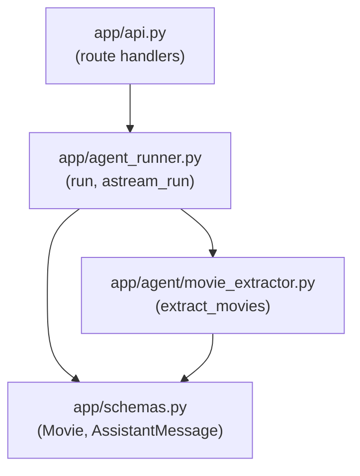
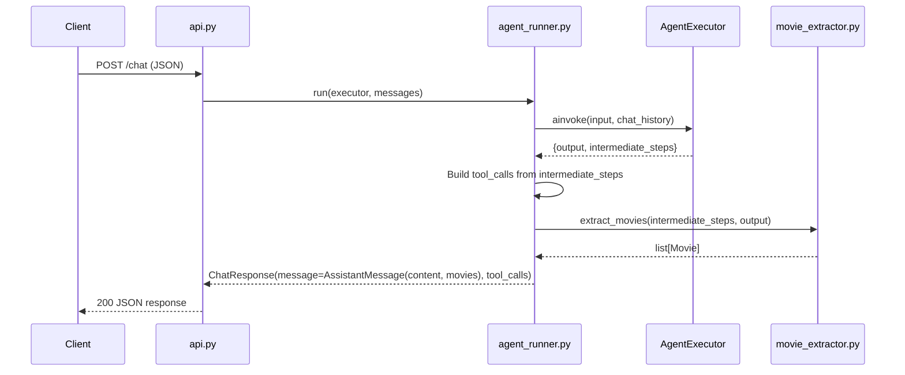
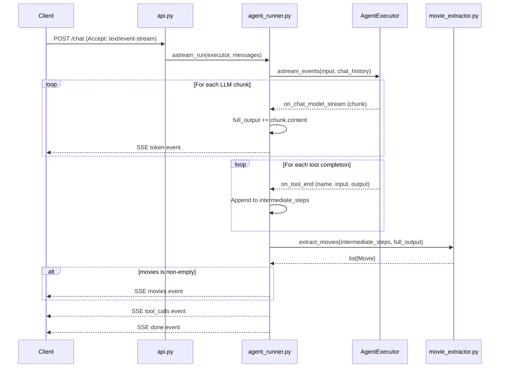

# Design Document — Movie Cards

## Overview

This feature extends the Agent Backend's `/chat` endpoint to return structured movie data alongside the assistant's prose response. A new deterministic post-processor (`movie_extractor`) inspects intermediate tool call results, filters movies to only those whose titles appear in the LLM's prose output, and returns them as structured `Movie` objects. The feature touches both JSON and SSE response modes, adds new Pydantic models, introduces a new module, and updates the API contract documentation.

### Design Goals

- **Deterministic extraction**: The movie list is derived purely from tool outputs and LLM content — no additional LLM calls, no randomness.
- **Backward compatible**: The `movies` field defaults to `[]`, so existing clients that ignore it are unaffected.
- **Resilient**: Malformed or errored tool outputs are silently skipped; the extractor never raises exceptions.
- **Minimal surface area**: One new module (`movie_extractor.py`), one new model (`Movie`), one field addition (`AssistantMessage.movies`), one new SSE event type (`movies`).

### Key Design Decisions

| Decision | Rationale |
|---|---|
| Title filtering uses case-insensitive substring match (`title.lower() in llm_content.lower()`) | Simple, predictable, matches how users read prose. Avoids regex complexity and false negatives from word-boundary matching. |
| Ordering by first mention position in LLM content | Cards appear in the same order the user reads them in the prose. |
| Deduplication by `id` (first-seen wins) | A movie may appear in multiple tool results (e.g., search + recommendations). We keep the first occurrence by mention order. |
| `max_count` defaults to 5 | Keeps the UI manageable. Configurable per call for future flexibility. |
| SSE `movies` event emitted after tokens, before `tool_calls` | Frontend can render cards as soon as the prose is complete, before the tool trace arrives. |
| `extract_movies` accepts `intermediate_steps` as `list[tuple[Any, str]]` | Works with both real `AgentAction` and `_FakeAction` objects from SSE mode — only `.tool` attribute is accessed. |

---

## Architecture

### Module Dependency Diagram



### Data Flow — JSON Mode



### Data Flow — SSE Mode



---

## Components and Interfaces

### 1. `app/schemas.py` — Model Changes

**New model: `Movie`**

```python
class Movie(BaseModel):
    """A single movie extracted from tool call results."""
    id: int
    title: str
    year: int | None = None
    poster_url: str | None = None
    rating: float | None = None
```

**Modified model: `AssistantMessage`**

```python
class AssistantMessage(BaseModel):
    """The assistant's reply message."""
    role: Literal["assistant"] = "assistant"
    content: str
    movies: list[Movie] = []
```

The `movies` field defaults to `[]` so existing serialization is backward compatible — clients that don't know about `movies` simply see an empty list or ignore it.

### 2. `app/agent/movie_extractor.py` — New Module

**Public interface:**

```python
MOVIE_TOOLS: frozenset[str] = frozenset({
    "search_movies",
    "discover_movies",
    "get_recommendations",
    "get_trending",
})

def extract_movies(
    intermediate_steps: list[tuple[Any, str]],
    llm_content: str,
    max_count: int = 5,
) -> list[Movie]:
    """
    Extract structured movie data from agent intermediate steps,
    filtered to only movies whose titles appear in the LLM's prose.

    Parameters
    ----------
    intermediate_steps : list[tuple[Any, str]]
        Ordered (action, raw_output) pairs from the agent run.
        action must have a `.tool` attribute (str).
    llm_content : str
        The full text of the LLM's prose response.
    max_count : int
        Maximum number of movies to return. Default 5.

    Returns
    -------
    list[Movie]
        Movies ordered by first mention position in llm_content,
        deduplicated by id, capped at max_count.
        Never raises — returns [] on any error.
    """
```

**Internal helpers:**

```python
def _parse_movies_from_output(raw_output: str) -> list[Movie]:
    """
    Parse a single tool output string into a list of Movie objects.
    Returns [] if the output is malformed, missing 'results', or contains an error envelope.
    """

def _find_title_position(title: str, llm_content_lower: str) -> int:
    """
    Return the index of the first case-insensitive occurrence of title in llm_content.
    Returns -1 if not found.
    """
```

### 3. `app/agent_runner.py` — Wiring Changes

**`run()` function changes:**

After building `tool_calls` from `intermediate_steps`, call `extract_movies` and attach the result to the `AssistantMessage`:

```python
from app.agent.movie_extractor import extract_movies

# ... existing tool_calls construction ...

movies = extract_movies(
    result.get("intermediate_steps", []),
    result.get("output", ""),
)

return ChatResponse(
    message=AssistantMessage(content=result.get("output", ""), movies=movies),
    tool_calls=tool_calls,
)
```

**`astream_run()` function changes:**

After the streaming loop completes and before emitting `tool_calls`, call `extract_movies` using the accumulated `full_output` and `intermediate_steps`. If the result is non-empty, emit a `movies` SSE event:

```python
from app.agent.movie_extractor import extract_movies

# ... after streaming loop, before tool_calls emission ...

movies = extract_movies(intermediate_steps, full_output)

if movies:
    movies_payload = json.dumps({
        "type": "movies",
        "movies": [m.model_dump() for m in movies],
    })
    yield f"data: {movies_payload}\n\n"

# ... existing tool_calls emission ...
```

### 4. `docs/contracts.md` — Documentation Updates

- Add `movies` field to JSON mode response example
- Add `movies` event row to SSE event table
- Add extraction policy note explaining deterministic post-processing

---

## Data Models

### Movie Model

| Field | Type | Required | Default | Source |
|---|---|---|---|---|
| `id` | `int` | Yes | — | `results[].id` from MCP tool output |
| `title` | `str` | Yes | — | `results[].title` from MCP tool output |
| `year` | `int \| None` | No | `None` | `results[].year` from MCP tool output |
| `poster_url` | `str \| None` | No | `None` | `results[].poster_url` from MCP tool output |
| `rating` | `float \| None` | No | `None` | `results[].rating` from MCP tool output |

### MCP Tool Output Shape (input to extractor)

The movie-returning tools produce output in this shape (as a JSON string):

```json
{
  "results": [
    {
      "id": 550,
      "title": "Fight Club",
      "year": 1999,
      "overview": "An insomniac office worker...",
      "poster_url": "https://image.tmdb.org/t/p/w500/...",
      "rating": 8.4
    }
  ]
}
```

The extractor maps `id`, `title`, `year`, `poster_url`, and `rating` from each result entry. The `overview` field is not included in the `Movie` model — it is not needed for card rendering.

### `extract_movies` Algorithm — Pseudocode

```
function extract_movies(intermediate_steps, llm_content, max_count=5):
    if llm_content is empty:
        return []

    llm_lower = llm_content.lower()

    # Phase 1: Collect all candidate movies from qualifying tool steps
    candidates = []
    for (action, raw_output) in intermediate_steps:
        if action.tool not in MOVIE_TOOLS:
            continue
        try:
            parsed = json.loads(raw_output)
        except (JSONDecodeError, TypeError):
            continue
        if "error" in parsed:
            continue
        results = parsed.get("results")
        if not isinstance(results, list):
            continue
        for entry in results:
            try:
                movie = Movie(
                    id=entry["id"],
                    title=entry["title"],
                    year=entry.get("year"),
                    poster_url=entry.get("poster_url"),
                    rating=entry.get("rating"),
                )
                candidates.append(movie)
            except (KeyError, TypeError, ValidationError):
                continue  # skip malformed entries

    # Phase 2: Filter to movies mentioned in LLM content
    mentioned = []
    for movie in candidates:
        pos = llm_lower.find(movie.title.lower())
        if pos >= 0:
            mentioned.append((pos, movie))

    # Phase 3: Sort by first mention position
    mentioned.sort(key=lambda pair: pair[0])

    # Phase 4: Deduplicate by id (first-seen wins)
    seen_ids = set()
    unique = []
    for pos, movie in mentioned:
        if movie.id not in seen_ids:
            seen_ids.add(movie.id)
            unique.append(movie)

    # Phase 5: Cap at max_count
    return unique[:max_count]
```

### Title Matching — Edge Cases

| Scenario | Behavior |
|---|---|
| LLM writes "fight club" but tool returns "Fight Club" | Match — case-insensitive |
| LLM writes "Se7en is great" and tool returns "Se7en" | Match — substring |
| Movie title "Up" appears in "I looked **up** some movies" | Match — this is a known limitation of substring matching. Short titles may produce false positives. Accepted trade-off for simplicity. |
| Movie title contains special regex characters (e.g., "10½") | No issue — we use `str.find()`, not regex |
| LLM content is empty string | No matches — returns `[]` immediately |
| Same movie from two different tools | Deduplicated by `id` — first mention position wins |

