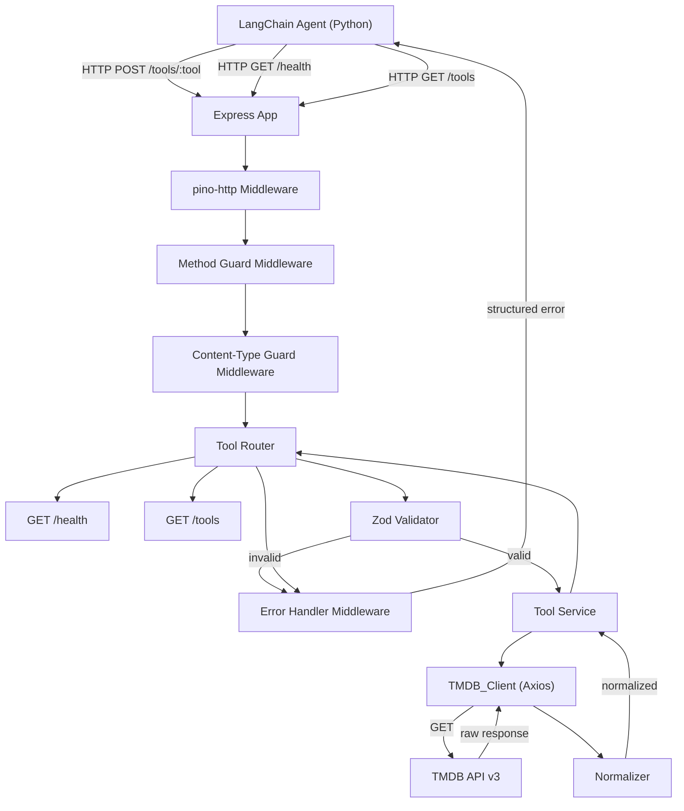

# Design Document — tmdb-mcp-server

## Overview

The `tmdb-mcp-server` is a Node.js/TypeScript Express microservice that wraps the TMDB (The Movie Database) REST API v3. It exposes seven discrete tool endpoints callable by a LangChain agent backend, plus health and discovery endpoints. The service normalizes TMDB's inconsistent response shapes into predictable, well-typed structures and enforces strict input validation, structured logging, and API key security.

**Key design goals:**
- Each tool endpoint is a thin orchestration layer: validate → call TMDB → normalize → respond
- All normalization is pure and side-effect-free, enabling straightforward property-based testing
- A single Axios instance (TMDB_Client) handles all outbound calls with centralized error interception
- Zod schemas serve as the single source of truth for both runtime validation and TypeScript types

**TMDB API base URL:** `https://api.themoviedb.org/3`  
**Authentication:** Bearer token via `Authorization: Bearer <TMDB_API_KEY>` header  
**Image base URL:** `https://image.tmdb.org/t/p/w500`

---

## Architecture



### Request Data Flow

A typical tool request follows this path:

1. **Ingress** — Express receives `POST /tools/{tool_name}` with JSON body
2. **Logging** — `pino-http` middleware records method, path, and attaches request ID
3. **Method guard** — rejects non-POST requests to tool endpoints with 405
4. **Content-Type guard** — rejects non-`application/json` bodies with 415
5. **Zod validation** — schema validates the request body; invalid → 400 immediately, TMDB never called
6. **Semantic validation** — service layer checks cross-field constraints (e.g., `year_from > year_to`) → 422
7. **TMDB_Client call** — Axios instance makes GET request(s) to TMDB API
8. **Error interception** — Axios interceptor maps TMDB 4xx/5xx to typed errors
9. **Normalization** — pure normalizer functions transform raw TMDB shapes to typed output
10. **Response** — service returns normalized payload; Express sends JSON response
11. **Log completion** — `pino-http` logs final status code on response finish

---

## Components and Interfaces

### Folder Structure

```
src/
├── lib/
│   ├── tmdbClient.ts        # Singleton Axios instance, interceptors, TMDB base config
│   └── logger.ts            # Pino logger factory (JSON prod, pretty dev)
├── schemas/
│   ├── searchMovies.ts      # Zod schema for search_movies input
│   ├── getMovieDetails.ts   # Zod schema for get_movie_details input
│   ├── discoverMovies.ts    # Zod schema for discover_movies input
│   ├── getRecommendations.ts# Zod schema for get_recommendations input
│   ├── getTrending.ts       # Zod schema for get_trending input
│   ├── getMovieId.ts        # Zod schema for get_movie_id input
│   └── getGenreId.ts        # Zod schema for get_genre_id input
├── types/
│   ├── tmdb.ts              # Raw TMDB API response types (TmdbMovieResult, TmdbMovieDetail, etc.)
│   ├── normalized.ts        # Normalized output types (MovieListItem, MovieDetail, etc.)
│   └── errors.ts            # AppError class and error code enum
├── services/
│   ├── searchMovies.ts      # search_movies business logic
│   ├── getMovieDetails.ts   # get_movie_details business logic
│   ├── discoverMovies.ts    # discover_movies business logic (auto-resolves genre names)
│   ├── getRecommendations.ts# get_recommendations business logic
│   ├── getTrending.ts       # get_trending business logic
│   ├── getMovieId.ts        # get_movie_id business logic
│   └── getGenreId.ts        # get_genre_id business logic + shared genre resolution
├── normalizers/
│   ├── movieListItem.ts     # Normalizes TmdbMovieResult → MovieListItem
│   └── movieDetail.ts       # Normalizes TmdbMovieDetail → MovieDetail
├── routes/
│   ├── health.ts            # GET /health handler
│   ├── tools.ts             # GET /tools handler (Tool_Registry)
│   └── toolHandlers.ts      # POST /tools/:tool dispatcher + per-tool handlers
├── middleware/
│   ├── errorHandler.ts      # Global Express error handler
│   ├── methodGuard.ts       # 405 for wrong HTTP methods on tool routes
│   └── contentTypeGuard.ts  # 415 for non-JSON POST bodies
├── registry/
│   └── toolRegistry.ts      # Static Tool_Registry definition
└── app.ts                   # Express app factory (no listen — testable)
index.ts                     # Entry point: env validation, server start
```

### Component Interfaces

#### TMDB_Client (`src/lib/tmdbClient.ts`)

```typescript
// Singleton Axios instance — import and use directly
export const tmdbClient: AxiosInstance;
```

- Created once at module load time
- `baseURL`: `https://api.themoviedb.org/3`
- Default headers: `Authorization: Bearer ${TMDB_API_KEY}`, `Accept: application/json`
- Response interceptor: maps TMDB 404 → `AppError(NOT_FOUND)`, 429 → `AppError(RATE_LIMITED)` with `Retry-After` propagation, other 4xx/5xx → `AppError(INTERNAL_ERROR)`

#### Logger (`src/lib/logger.ts`)

```typescript
export const logger: pino.Logger;
```

- `pino-http` middleware instance exported separately for Express use
- `NODE_ENV === 'development'` → `pino-pretty` transport
- Redacts `req.headers.authorization` to prevent API key leakage in logs

#### Normalizers (`src/normalizers/`)

```typescript
// Pure functions — no side effects, no I/O
export function normalizeMovieListItem(raw: TmdbMovieResult): MovieListItem;
export function normalizeMovieDetail(raw: TmdbMovieDetailWithAppended): MovieDetail;
export function buildPosterUrl(posterPath: string | null | undefined): string | null;
export function extractYear(releaseDate: string | null | undefined): number | null;
export function extractGenreNames(genres: TmdbGenre[] | undefined): string[];
export function extractCast(cast: TmdbCastMember[] | undefined): CastMember[];
export function extractDirector(crew: TmdbCrewMember[] | undefined): string | null;
```

#### AppError (`src/types/errors.ts`)

```typescript
export enum ErrorCode {
  VALIDATION_ERROR = 'VALIDATION_ERROR',
  NOT_FOUND = 'NOT_FOUND',
  NO_RESULTS = 'NO_RESULTS',
  UNPROCESSABLE_INPUT = 'UNPROCESSABLE_INPUT',
  RATE_LIMITED = 'RATE_LIMITED',
  METHOD_NOT_ALLOWED = 'METHOD_NOT_ALLOWED',
  UNSUPPORTED_MEDIA_TYPE = 'UNSUPPORTED_MEDIA_TYPE',
  INTERNAL_ERROR = 'INTERNAL_ERROR',
}

export class AppError extends Error {
  constructor(
    public readonly code: ErrorCode,
    public readonly statusCode: number,
    message: string,
    public readonly retryAfter?: string,
  ) { super(message); }
}
```

#### Tool Registry (`src/registry/toolRegistry.ts`)

```typescript
export interface ToolDefinition {
  name: string;
  description: string;
  input_schema: Record<string, unknown>; // JSON Schema object derived from Zod
}

export const toolRegistry: ToolDefinition[];
// Contains all seven tools: search_movies, get_movie_details, discover_movies,
// get_recommendations, get_trending, get_movie_id, get_genre_id
```

---

## Data Models

### Raw TMDB Types (`src/types/tmdb.ts`)

```typescript
interface TmdbMovieResult {
  id: number;
  title: string;
  release_date: string | null;
  overview: string;
  poster_path: string | null;
  vote_average: number;
  genre_ids: number[];
}

interface TmdbGenre {
  id: number;
  name: string;
}

interface TmdbCastMember {
  name: string;
  character: string;
  order: number;
}

interface TmdbCrewMember {
  name: string;
  job: string;
  department: string;
}

interface TmdbKeyword {
  id: number;
  name: string;
}

interface TmdbMovieDetail {
  id: number;
  title: string;
  release_date: string | null;
  overview: string;
  poster_path: string | null;
  vote_average: number;
  runtime: number | null;
  genres: TmdbGenre[];
}

interface TmdbMovieDetailWithAppended extends TmdbMovieDetail {
  credits: {
    cast: TmdbCastMember[];
    crew: TmdbCrewMember[];
  };
  keywords: {
    keywords: TmdbKeyword[];
  };
}

interface TmdbPagedResponse<T> {
  results: T[];
  total_results: number;
  total_pages: number;
  page: number;
}
```

### Normalized Output Types (`src/types/normalized.ts`)

```typescript
interface MovieListItem {
  id: number;
  title: string;
  year: number | null;
  overview: string;
  poster_url: string | null;
  rating: number;
}

interface CastMember {
  name: string;
  character: string;
}

interface MovieDetail extends MovieListItem {
  runtime: number | null;
  genres: string[];
  cast: CastMember[];       // top 5 only
  director: string | null;
  keywords: string[];
}
```

### Zod Schemas (`src/schemas/`)

```typescript
// searchMovies.ts
export const SearchMoviesSchema = z.object({
  query: z.string().min(1),
  year: z.number().int().optional(),
});

// getMovieDetails.ts
export const GetMovieDetailsSchema = z.object({
  movie_id: z.number().int(),
});

// discoverMovies.ts
export const DiscoverMoviesSchema = z.object({
  genre: z.string().optional(),
  min_rating: z.number().min(0).max(10).optional(),
  year_from: z.number().int().optional(),
  year_to: z.number().int().optional(),
});

// getRecommendations.ts
export const GetRecommendationsSchema = z.object({
  movie_id: z.number().int(),
});

// getTrending.ts
export const GetTrendingSchema = z.object({
  window: z.enum(['day', 'week']),
});

// getMovieId.ts
export const GetMovieIdSchema = z.object({
  query: z.string().min(1),
  year: z.number().int().optional(),
});

// getGenreId.ts
export const GetGenreIdSchema = z.object({
  name: z.string().min(1),
});
```

---

## Correctness Properties

*A property is a characteristic or behavior that should hold true across all valid executions of a system — essentially, a formal statement about what the system should do. Properties serve as the bridge between human-readable specifications and machine-verifiable correctness guarantees.*

The normalizer functions are pure (no I/O, no side effects) and operate over a well-defined input space, making them ideal candidates for property-based testing. The validation layer also has universal properties: for any invalid input, the response shape and status code must be consistent. Property-based testing is performed using [fast-check](https://fast-check.dev/) with [zod-fast-check](https://www.npmjs.com/package/zod-fast-check) to derive arbitraries from Zod schemas.

---

### Property 1: Movie list item normalization preserves required fields with correct types

*For any* raw TMDB movie result object (with any combination of null/non-null `poster_path` and `release_date`), the `normalizeMovieListItem` function SHALL produce an output object that contains `id` (number), `title` (string), `year` (number or null), `overview` (string), `poster_url` (string or null), and `rating` (number).

**Validates: Requirements 1.3, 3.3, 4.2, 5.2, 9.1, 9.2, 9.4, 9.5**

---

### Property 2: Movie detail normalization preserves all required fields with correct types

*For any* raw TMDB movie detail object with appended credits and keywords (with any combination of cast sizes, crew compositions, genre arrays, and keyword arrays), the `normalizeMovieDetail` function SHALL produce an output object containing all fields from Property 1 plus `runtime` (number or null), `genres` (array of strings), `cast` (array of at most 5 `{ name, character }` objects), `director` (string or null), and `keywords` (array of strings).

**Validates: Requirements 2.2, 9.3**

---

### Property 3: poster_url construction is a deterministic function of poster_path

*For any* non-null, non-empty `poster_path` string, `buildPosterUrl` SHALL return a string equal to `"https://image.tmdb.org/t/p/w500"` concatenated with the `poster_path` value. For any null or undefined `poster_path`, `buildPosterUrl` SHALL return `null`.

**Validates: Requirements 9.1, 9.2**

---

### Property 4: Year extraction is a deterministic function of release_date

*For any* `release_date` string in `YYYY-MM-DD` format, `extractYear` SHALL return the integer value of the first four characters. For any null, undefined, or malformed `release_date`, `extractYear` SHALL return `null`.

**Validates: Requirements 9.4, 9.5**

---

### Property 5: Invalid tool inputs always produce 400 VALIDATION_ERROR and never reach TMDB

*For any* request body that fails the Zod schema for any tool endpoint (missing required fields, wrong types, empty strings where non-empty is required, enum values outside the allowed set), the server SHALL return a 400 response with `{ error: { code: "VALIDATION_ERROR", message: string } }`, and the TMDB_Client SHALL NOT be called.

**Validates: Requirements 1.4, 2.3, 3.4, 4.3, 5.3, 6.4, 15.1, 15.2, 15.3**

---

### Property 6: Semantic validation rejects year_from > year_to

*For any* `discover_movies` request body where `year_from` and `year_to` are both present and `year_from > year_to`, the server SHALL return a 422 response with `{ error: { code: "UNPROCESSABLE_INPUT", message: string } }`.

**Validates: Requirements 3.1, 10.3**

---

### Property 7: All error responses conform to the structured error shape

*For any* request that results in an error (validation failure, not found, rate limit, internal error, method not allowed, unsupported media type), the response body SHALL be `{ error: { code: string, message: string } }` where `code` is one of the defined `ErrorCode` enum values.

**Validates: Requirements 10.1, 10.2, 10.3, 10.4, 10.5, 10.6, 10.7, 10.8, 10.9**

---

### Property 8: The TMDB API key never appears in any HTTP response body

*For any* request to any endpoint under any error or success condition, the response body string SHALL NOT contain the value of the `TMDB_API_KEY` environment variable.

**Validates: Requirements 11.2, 11.3, 10.9**

---

### Property 9: Request logs always contain method, path, and status

*For any* HTTP request processed by the server, the structured log entry emitted by `pino-http` SHALL contain the fields `method` (string), `url` (string), and `statusCode` (number).

**Validates: Requirements 12.1**

---

### Property 10: Cast is always limited to the top 5 members

*For any* TMDB credits response with any number of cast members (0 to N), `extractCast` SHALL return an array of at most 5 elements, preserving the original order (TMDB returns cast ordered by billing).

**Validates: Requirements 2.2**

---

## Error Handling

### Error Handler Middleware (`src/middleware/errorHandler.ts`)

The global Express error handler is the single point of error serialization. It receives `AppError` instances (thrown by services and the TMDB_Client interceptor) and unknown errors, and maps them to structured HTTP responses.

```
AppError → { status: error.statusCode, body: { error: { code, message } } }
ZodError → { status: 400, body: { error: { code: "VALIDATION_ERROR", message: <field details> } } }
Unknown  → { status: 500, body: { error: { code: "INTERNAL_ERROR", message: "An unexpected error occurred" } } }
```

For `RATE_LIMITED` errors, the handler propagates the `Retry-After` header if present on the `AppError` instance.

The handler logs every error via the pino logger with `code` and a sanitized `message`. It never logs the raw error stack in production (`NODE_ENV !== 'development'`).

### TMDB_Client Error Interceptor

The Axios response interceptor in `src/lib/tmdbClient.ts` handles all non-2xx TMDB responses before they reach service code:

| TMDB Status | Thrown AppError |
|---|---|
| 404 | `AppError(NOT_FOUND, 404, "Resource not found on TMDB")` |
| 429 | `AppError(RATE_LIMITED, 429, "TMDB rate limit reached", retryAfter)` |
| 401 | `AppError(INTERNAL_ERROR, 500, "TMDB authentication failed")` — never exposes key |
| Other 4xx/5xx | `AppError(INTERNAL_ERROR, 500, "Upstream error")` |

### Semantic Validation

The `discoverMovies` service performs cross-field validation after Zod schema validation passes:

```typescript
if (input.year_from !== undefined && input.year_to !== undefined) {
  if (input.year_from > input.year_to) {
    throw new AppError(ErrorCode.UNPROCESSABLE_INPUT, 422,
      'year_from must not be greater than year_to');
  }
}
```

It also performs genre name resolution when `genre` is provided as a non-numeric string:

```typescript
// Numeric string → use directly as genre ID
// Non-numeric string → resolve via getGenreId() → throws NO_RESULTS if unrecognised
const numericId = parseInt(input.genre, 10);
if (!isNaN(numericId) && String(numericId) === input.genre.trim()) {
  params['with_genres'] = numericId;
} else {
  const { genre_id } = await getGenreId(input.genre); // shared with get_genre_id tool
  params['with_genres'] = genre_id;
}
```

The `getGenreId` service is shared between the `discover_movies` service (internal use) and the `get_genre_id` tool endpoint (external use). It fetches `/genre/movie/list` from TMDB and performs a case-insensitive name match, throwing `AppError(NO_RESULTS, 404, ...)` with the full list of available genre names if no match is found.

### Method and Content-Type Guards

- `methodGuard` middleware: registered on `POST /tools/*` routes; if method is not POST, throws `AppError(METHOD_NOT_ALLOWED, 405, ...)`
- `contentTypeGuard` middleware: checks `Content-Type: application/json` on POST requests; if absent or wrong, throws `AppError(UNSUPPORTED_MEDIA_TYPE, 415, ...)`

---

## Testing Strategy

### Dual Testing Approach

Both unit/property tests and integration tests are used for comprehensive coverage.

**Unit + Property Tests** (fast-check, Jest):
- All normalizer functions (pure, no I/O) — property-based with generated inputs
- Zod schema validation — property-based with generated invalid inputs
- Error handler middleware — example-based
- Semantic validation logic — property-based

**Integration Tests** (Jest + supertest, mocked Axios):
- Each tool endpoint end-to-end with mocked TMDB responses
- Error propagation (404, 429, 500 from TMDB)
- Health and discovery endpoints
- Method guard and content-type guard behavior

### Property-Based Testing Setup

**Library:** [fast-check](https://fast-check.dev/) v3.x with [@fast-check/jest](https://www.npmjs.com/package/@fast-check/jest)  
**Schema arbitraries:** [zod-fast-check](https://www.npmjs.com/package/zod-fast-check) to derive arbitraries from Zod schemas  
**Minimum iterations:** 100 per property test (fast-check default)

Each property test is tagged with a comment referencing the design property:

```typescript
// Feature: tmdb-mcp-server, Property 1: Movie list item normalization preserves required fields
test.prop([tmdbMovieResultArbitrary])('normalizeMovieListItem output shape', (raw) => {
  const result = normalizeMovieListItem(raw);
  expect(typeof result.id).toBe('number');
  expect(typeof result.title).toBe('string');
  // ...
});
```

### Test File Structure

```
tests/
├── unit/
│   ├── normalizers/
│   │   ├── movieListItem.property.test.ts   # Properties 1, 3, 4, 10
│   │   └── movieDetail.property.test.ts     # Properties 2, 10
│   ├── schemas/
│   │   └── validation.property.test.ts      # Properties 5, 6 (all 7 schemas)
│   └── middleware/
│       └── errorHandler.test.ts             # Property 7
├── integration/
│   ├── tools/
│   │   ├── searchMovies.test.ts
│   │   ├── getMovieDetails.test.ts
│   │   ├── discoverMovies.test.ts           # includes genre name resolution tests
│   │   ├── getRecommendations.test.ts
│   │   ├── getTrending.test.ts
│   │   ├── getMovieId.test.ts
│   │   └── getGenreId.test.ts
│   ├── health.test.ts
│   └── tools-discovery.test.ts              # asserts 7 tools
└── security/
    └── apiKeyLeakage.property.test.ts       # Properties 8, 9
```

---

## Additional Deliverables

### contracts.md

The `contracts.md` file documents all endpoint request/response contracts. See the full content below — this file should be created at the project root.

---

**`contracts.md` content:**

```markdown
# API Contracts — tmdb-mcp-server

All tool endpoints accept `POST` requests with `Content-Type: application/json`.
All responses are JSON. All error responses follow the shape:
{ "error": { "code": string, "message": string } }

---

## GET /health

**Response 200:**
{ "status": "ok" }

---

## GET /tools

**Response 200:**
{
  "tools": [
    {
      "name": string,
      "description": string,
      "input_schema": object  // JSON Schema
    }
  ]
}

---

## POST /tools/search_movies

**Request:**
{
  "query": string,       // required, non-empty
  "year": number         // optional, integer
}

**Response 200:**
{
  "results": [
    {
      "id": number,
      "title": string,
      "year": number | null,
      "overview": string,
      "poster_url": string | null,
      "rating": number
    }
  ]
}

**Errors:**
- 400 VALIDATION_ERROR — query missing or empty
- 429 RATE_LIMITED — TMDB rate limit reached
- 500 INTERNAL_ERROR — unexpected error

---

## POST /tools/get_movie_details

**Request:**
{ "movie_id": number }   // required, integer

**Response 200:**
{
  "id": number,
  "title": string,
  "year": number | null,
  "overview": string,
  "poster_url": string | null,
  "rating": number,
  "runtime": number | null,
  "genres": string[],
  "cast": [{ "name": string, "character": string }],  // top 5
  "director": string | null,
  "keywords": string[]
}

**Errors:**
- 400 VALIDATION_ERROR — movie_id missing or not a number
- 404 NOT_FOUND — movie does not exist on TMDB
- 429 RATE_LIMITED
- 500 INTERNAL_ERROR

---

## POST /tools/discover_movies

**Request:**
{
  "genre": string,        // optional
  "min_rating": number,   // optional, 0–10
  "year_from": number,    // optional, integer
  "year_to": number,      // optional, integer
  "keywords": string      // optional
}

**Response 200:**
{
  "results": [
    {
      "id": number,
      "title": string,
      "year": number | null,
      "overview": string,
      "poster_url": string | null,
      "rating": number
    }
  ]
}

**Errors:**
- 400 VALIDATION_ERROR — invalid field types
- 422 UNPROCESSABLE_INPUT — year_from > year_to
- 429 RATE_LIMITED
- 500 INTERNAL_ERROR

---

## POST /tools/get_recommendations

**Request:**
{ "movie_id": number }   // required, integer

**Response 200:**
{
  "results": [
    {
      "id": number,
      "title": string,
      "year": number | null,
      "overview": string,
      "poster_url": string | null,
      "rating": number
    }
  ]
}

**Errors:**
- 400 VALIDATION_ERROR — movie_id missing or not a number
- 404 NOT_FOUND — movie does not exist on TMDB
- 429 RATE_LIMITED
- 500 INTERNAL_ERROR

---

## POST /tools/get_trending

**Request:**
{ "window": "day" | "week" }   // required

**Response 200:**
{
  "results": [
    {
      "id": number,
      "title": string,
      "year": number | null,
      "overview": string,
      "poster_url": string | null,
      "rating": number
    }
  ]
}

**Errors:**
- 400 VALIDATION_ERROR — window missing or not "day"/"week"
- 429 RATE_LIMITED
- 500 INTERNAL_ERROR

---

## POST /tools/get_movie_id

**Request:**
{
  "query": string,   // required, non-empty
  "year": number     // optional, integer
}

**Response 200:**
{ "movie_id": number }

**Errors:**
- 400 VALIDATION_ERROR — query missing or empty
- 404 NO_RESULTS — no matching movie found
- 429 RATE_LIMITED
- 500 INTERNAL_ERROR

---

## Common Error Codes

| Code | HTTP Status | Meaning |
|---|---|---|
| VALIDATION_ERROR | 400 | Request body failed schema validation |
| NOT_FOUND | 404 | Requested resource does not exist on TMDB |
| NO_RESULTS | 404 | Search/lookup returned zero results |
| METHOD_NOT_ALLOWED | 405 | HTTP method not supported for this endpoint |
| UNSUPPORTED_MEDIA_TYPE | 415 | Content-Type is not application/json |
| UNPROCESSABLE_INPUT | 422 | Semantically invalid input (e.g., year_from > year_to) |
| RATE_LIMITED | 429 | TMDB upstream rate limit reached |
| INTERNAL_ERROR | 500 | Unexpected server error |
```

---

### README.md Outline

The `README.md` should be created at the project root and cover:

1. **Overview** — what the service does, who it's for (LangChain agent backend)
2. **Prerequisites** — Node.js 20+, Docker (optional), TMDB API key
3. **Environment Variables**
   - `TMDB_API_KEY` (required) — obtain from [themoviedb.org](https://www.themoviedb.org/settings/api)
   - `PORT` (optional, default 3000)
   - `NODE_ENV` (optional, `development` for pretty logs)
4. **Local Setup**
   ```bash
   npm install
   cp .env.example .env   # add TMDB_API_KEY
   npm run dev
   ```
5. **Running with Docker**
   ```bash
   docker build -t tmdb-mcp-server .
   docker run -p 3000:3000 -e TMDB_API_KEY=your_key tmdb-mcp-server
   ```
6. **Running Tests**
   ```bash
   npm test
   ```
7. **curl Examples** — one per tool endpoint, plus health and discovery
8. **Tool Reference** — brief description of each tool with input/output summary
9. **Architecture Notes** — link to design.md
