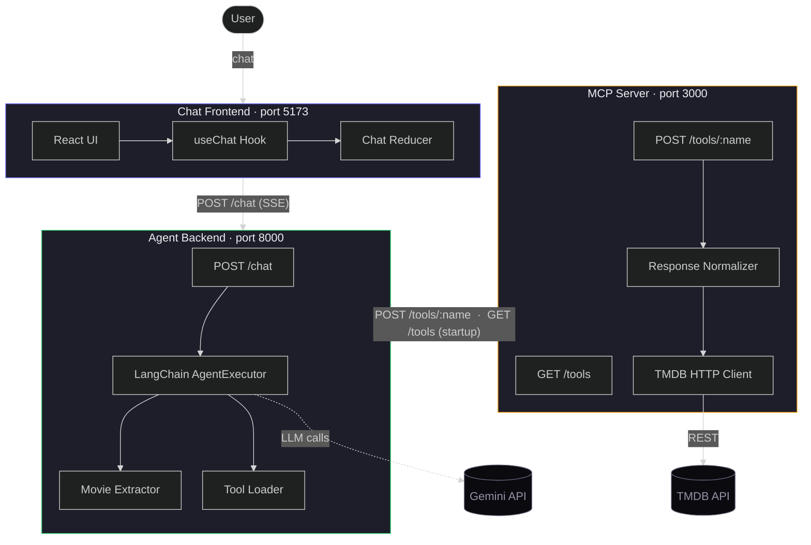

# Architecture — Movie Agent MCP

## Trust Boundaries

Each service holds exactly one secret and never exposes it across service boundaries:

- The **MCP server** holds `TMDB_API_KEY`. It is the only service that communicates with the TMDB REST API. In a production deployment, it should sit on a private network — only the agent backend calls it.
- The **Agent backend** holds `GEMINI_API_KEY`. It is the only service that communicates with the Gemini API. It discovers tools from the MCP server at startup and proxies tool calls during agent runs, but never forwards its own secret.
- The **Chat frontend** holds no secrets. All authentication and API key management happens server-side. The frontend communicates only with the agent backend over HTTP.

No secret is ever included in HTTP response bodies, SSE events, or log output. The agent backend uses `pydantic.SecretStr` for the Gemini key; the MCP server validates the TMDB key is present at startup and never serializes it.
